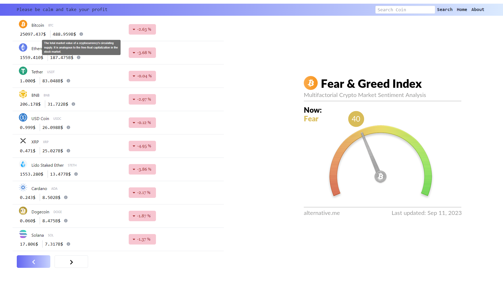
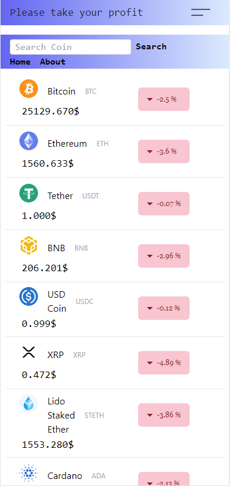

# *Coin Market Price*

Application for checking changes in the price of coins per day.

# Demo View
### Web version

___

### Mobile version

# About

Easily monitor price changes and trends with our intuitive price
            change charts. We offer hourly, daily, and weekly price
            fluctuations, enabling you to make informed decisions when buying or
            selling. Our website keeps you updated with a clear visual
            representation of price movements.

# Buit With

+ TypeScript
+ ReactQuery
+ Tailwind
+ Redux Toolkit

# Installation

Clone the repo https://github.com/chesnovski/rqt-query
